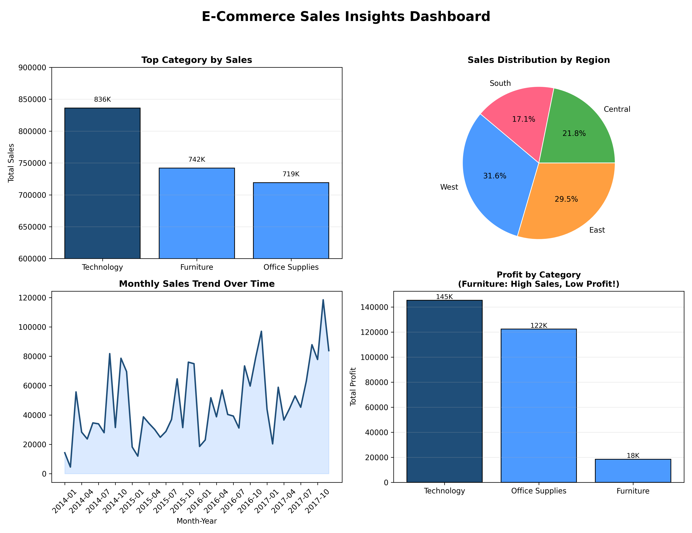

  
  
  

<h1 align="center">📊 E-Commerce Performance Diagnostic Dashboard</h1>

Transforming raw transactional data into actionable business insights 🚀

<b>End-to-End Data Analysis Project</b>

📊 Built using real-world business questions to simulate a data analyst workflow

---

## 📖 Executive Summary
An exploratory analysis of Superstore transactional data designed to move beyond surface-level metrics (such as total sales) and uncover **true profitability drivers, inefficiencies, and regional disparities**.

This project converts raw transactional data into a **decision-support dashboard**, enabling stakeholders to identify high-performing segments and potential areas of concern.

---

## 🔍 Key Business Findings

### 💰 Profitability Insight (Furniture vs Technology)
- Despite generating **~$742K in revenue**, the **Furniture category delivers only ~$18K profit**
- In contrast, **Technology leads both in revenue (~$836K) and profit (~$145K)**
- 📌 Indicates potential **margin leakage, high costs, or discount inefficiencies** in Furniture

---

### 🌍 Regional Performance
- The **West region contributes ~32% of total sales**
- Nearly **double the contribution of the South region (~17%)**
- 📌 Suggests either:
  - Market saturation in the West  
  - Untapped growth potential in underperforming regions  

---

### 📈 Sales Trend Analysis
- Monthly trends show **consistent baseline performance**
- Presence of **seasonal spikes**
- 📌 Useful for:
  - Inventory planning  
  - Workforce allocation  
  - Demand forecasting  

---

## 📊 Dashboard Preview

  

---

## ⚙️ Technical Architecture

| Component | Description |
|----------|------------|
| **Data Processing** | Pandas (GroupBy, aggregation, datetime handling) |
| **Visualization** | Matplotlib (subplots, styling, annotation) |
| **Environment** | Python 3.x |

---

## 🧠 Skills Demonstrated
- Exploratory Data Analysis (EDA)
- Business Insight Generation
- Data Visualization & Storytelling
- Analytical Thinking

---

## 📂 Repository Structure
ecommerce-sales-analysis/
│
├── Ecommerce-sales-analysis/
│ ├── data/
│ │ └── superstore.csv
│ ├── analysis.py
│ └── dashboard.png
│
└── README.md

---

## ▶️ How to Run the Project

1. Clone the repository  
2. Install required libraries
   
pip install pandas matplotlib

4. Run the analysis script

---

## 💡 Conclusion
This analysis highlights how data-driven approaches can uncover hidden inefficiencies and growth opportunities.

The project demonstrates the importance of combining **data analysis, visualization, and business understanding** to support strategic decision-making.

---

## 🔗 Connect With Me
If you found this project valuable or would like to collaborate, feel free to connect 🚀
